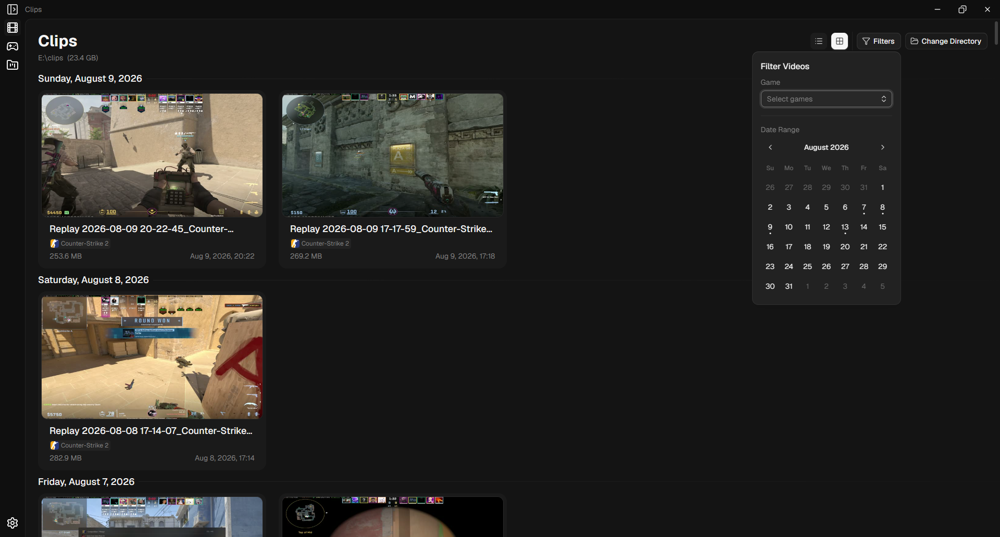
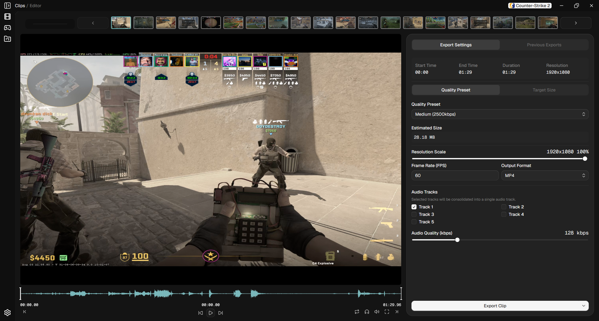

<h1 align="center">Clip Editor</h1>

<div align="center">
    
    
    
    
    
</div>

A desktop application for recording, editing, managing, and organizing your game clips. Built with Tauri, React, and Rust.

## Features

- **Replay Buffer**: Continuously capture your screen and per-application audio, then save the last few seconds to a clip with a global hotkey
- **Edit Video Clips**: Trim and cut video clips by setting custom start and end markers
- **Organize Content**: Group related clips together with customizable colored tags
- **Game Detection**: Automatically categorize clips by game with Steam integration, artwork, and aliases
- **Advanced Filtering**: Find clips by date, game, or custom groups
- **Export Options**: Export clips as MP4, WebM, MOV, MKV, or GIF, with hardware-accelerated encoding
- **Copy to Clipboard**: Copy exported clips directly to your clipboard
- **Auto-Updates**: Install new releases with one click from the Settings page

## Screenshots


_The main clip browser interface_


_The clip editing interface_

## Installation

### From Releases

1. Go to the [Releases](https://github.com/sn0w12/clip-editor/releases) page
2. Download the installer for your operating system
3. Run the installer and follow the prompts

### From Source

```bash
git clone https://github.com/sn0w12/clip-editor

# Navigate to project folder
cd clip-editor
# Install dependencies
npm install
# Start the development server
npm run tauri dev
```

## Usage

### Getting Started

1. Launch the application
2. Select a directory containing your game recordings — the library watches it for new clips
3. Customize your recording settings in the Settings page

### Replay Buffer

1. Go to **Settings → Recording**
2. Configure the buffer duration, capture FPS, codec, and audio routing
3. Click "Start buffer" (or enable "Start replay buffer on startup" with launch-on-startup)
4. Press the global save hotkey at any moment to save the last N seconds as a clip

### Editing Clips

1. Click on a clip to open it in the editor
2. Use the timeline and markers to set your desired start and end points, and add cuts
3. Configure export settings in the sidebar
4. Click "Export" to save your edited clip, or copy it straight to your clipboard

### Organizing Clips

**Creating Groups**

- Create a group from the home page toolbar
- Name your group and select a color
- Add clips to your group via the right-click context menu

**Game Detection**

- Point the Steam directory setting at your Steam install root to import games and artwork
- Right-click a clip to set its game, add a custom game, or alias an auto-detected name to a Steam game

**Filtering**

- Use the date picker to filter clips by date range
- Select games to filter by game
- Choose groups to view clips in specific groups

## Technical Details

- **Framework**: Tauri 2, React, TypeScript, Rust
- **UI Components**: Base UI, Tailwind CSS
- **Routing**: TanStack Router
- **Video Processing**: FFmpeg
- **Database**: SQLite
- **Screen Capture**: Windows Graphics Capture and Windows Audio Session API (via the `screencap` crate)
- **Auto-Updates**: `tauri-plugin-updater`

## Platform Support

Windows is the supported platform. The replay buffer relies on Windows capture APIs (Windows Graphics Capture and Windows Audio Session API), and release builds are produced for Windows only.

## Settings

The application includes a comprehensive settings page where you can configure:

- Replay buffer capture (duration, FPS, codec, quality, cursor)
- Per-application audio routing and output tracks
- Export preferences
- Launch on startup behavior
- Remappable keyboard shortcuts
- Steam integration settings

## License

This project is licensed under the GPL-3.0 License - see the LICENSE file for details.
