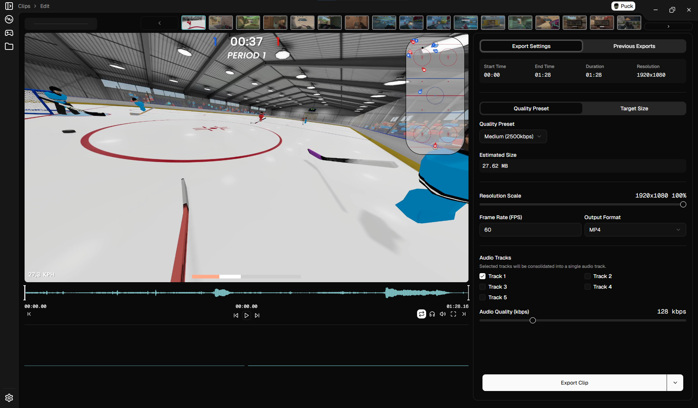

<h1 align="center">Clip Editor</h1>

<div align="center">
    
    
    
    
    
</div>

A desktop application for editing, managing, and organizing your video clips. Built with Electron, React, and TypeScript.

## Features

- **Edit Video Clips**: Trim video clips by setting custom start and end points
- **Organize Content**: Group related clips together with customizable colored tags
- **Game Detection**: Automatically categorize clips by game with Steam integration
- **Advanced Filtering**: Find clips by date, game, or custom groups
- **Export Options**: Export clips with customizable settings
- **Steam Integration**: View game artwork and metadata for your clips

## Screenshots


*The main clip browser interface*


*The clip editing interface*

## Installation

### From Releases

1. Go to the [Releases](https://github.com/sn0w12/clip-editor/releases) page
2. Download the installer for your operating system
3. Run the installer and follow the prompts

### From Source

```bash
git clone https://github.com/sn0w12/clip-editor

# Navigate to project folder
cd clip-editor
# Install dependencies
npm install
# Start the development server
npm run dev
```

> [!IMPORTANT]
> If you are building locally, you must set the `GOOGLE_CLIENT_ID` and `GOOGLE_CLIENT_SECRET` environment variables in your shell before running build or dev commands.
> Setting these in a `.env` file will **not** work.
>
> **Example (Linux/macOS/Windows Command Prompt):**
> ```bash
> export GOOGLE_CLIENT_ID=your-google-client-id
> export GOOGLE_CLIENT_SECRET=your-google-client-secret
> npm run dev
> ```
>
> **Example (Windows PowerShell):**
> ```powershell
> $env:GOOGLE_CLIENT_ID="your-google-client-id"
> $env:GOOGLE_CLIENT_SECRET="your-google-client-secret"
> npm run dev
> ```

## Usage

### Note

When clipping with obs, use [this lua script](https://gist.github.com/sn0w12/38853cff52d219f99a3c44c007103d18) to automatically add the game name to the clips filename. This will allow the program to categorize the clip.

### Getting Started

1. Launch the application
2. Select a directory containing your video clips
3. Browse through your clips, which will be automatically organized
4. Use filters to find specific clips by date, game, or other criteria

### Editing Clips

1. Click on a clip to open it in the editor
2. Use the timeline to set your desired start and end points
3. Configure export settings in the sidebar
4. Click "Export" to save your edited clip

### Organizing Clips

**Creating Groups**
- Click the "Create Group" button
- Name your group and select a color
- Add clips to your group by selecting them and using the "Add to Group" option

**Filtering**
- Use the date picker to filter clips by date range
- Select games from the dropdown to filter by game
- Choose groups from the sidebar to view clips in specific groups

## Technical Details

- **Framework**: Electron, React, TypeScript
- **UI Components**: shadcn/ui
- **Video Processing**: FFmpeg
- **File System Access**: Node.js APIs through Electron's IPC

## Settings

The application includes a comprehensive settings page where you can configure:
- Export preferences
- File locations
- Interface options
- Steam integration settings

## License

This project is licensed under the GPL-3.0 License - see the LICENSE file for details.

## Acknowledgments

- [FFmpeg](https://ffmpeg.org/) for video processing capabilities
- [Electron](https://www.electronjs.org/) for enabling cross-platform desktop apps
- [shadcn/ui](https://ui.shadcn.com/) for beautiful UI components
